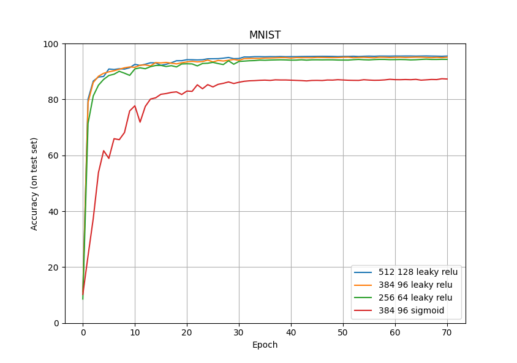

## MNIST from scratch

- Fully connected 3-layer neural network
- Just use `numpy`, no `pytorch`
- Reach over 95% accuracy (on test set)
- Adjustable hidden layer size, activation function, learning rate, etc.

---

Referenced [MLForNerds/DL_Projects](https://github.com/MLForNerds/DL_Projects)